# Restauracja Esencja — system rezerwacji stolików

> Karta menu, interaktywny plan sali i panel gościa dla restauracji fine dining w Warszawie.

Esencja to strona restauracji z Krakowskiego Przedmieścia połączona z rezerwacją konkretnego stolika. Gość
przegląda kartę menu, wybiera datę i godzinę, a potem klika wolny stolik na planie sali — od dwuosobowego
przy oknie po ośmioosobowy stół w sali VIP. Po założeniu konta ma panel z rezerwacjami, ulubionymi daniami,
ocenami i historią kaucji.

Całość to jednostronicowa aplikacja React 19 + TypeScript, zbudowana Vite i ostylowana Tailwind CSS 4.
Nie ma backendu: konta, rezerwacje i oceny są zapisywane w `localStorage` przeglądarki. To prototyp
gotowy do pokazania klientowi i do podpięcia pod API — nie system produkcyjny (szczegóły niżej).

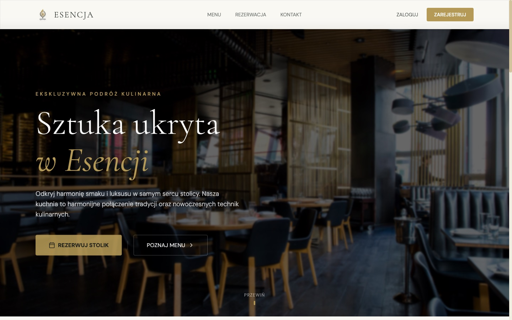

## Dla kogo

- **Dla gości restauracji** — karta menu ze zdjęciami i cenami, sprawdzenie, które stoliki są wolne o danej
  godzinie, wybór konkretnego miejsca na planie sali i rezerwacja bez dzwonienia. Rezerwować można jako gość
  albo z konta.
- **Dla właściciela i obsługi** — gotowy front-end, który pokazuje, jak rezerwacja stolika może wyglądać
  u nich: plan sali odwzorowuje strefy (sala główna, VIP, szatnia, toalety), a zasady kaucji i czasu trwania
  wizyty są w jednym pliku.
- **Dla deweloperów** — czytelna baza pod prawdziwy system: komponenty per widok, typy danych w jednym miejscu
  i spisane endpointy, które zastąpią `localStorage` ([`docs/documentation.pdf`](docs/documentation.pdf)).

Czym Esencja **nie jest**: nie jest jeszcze systemem, z którego restauracja może przyjmować rezerwacje.
Rezerwacje widzi tylko przeglądarka, w której powstały, a płatności kaucji są symulowane.

## Jak to działa

```
index.html ─► main.tsx ─► App.tsx   (aktywny widok ⇄ #hash w adresie, zalogowany użytkownik)
                              │
  ┌──────────┬────────────┬───┴────────┬───────────┬──────────────┐
 Hero       Menu      Reservation   ContactMap   Dashboard     Auth (modal)
 start      #menu     #rezerwacja   #kontakt     #panel        logowanie / rejestracja
             │            │                        │              │
             └────────────┴────── localStorage ────┴──────────────┘
```

**Widoki** przełączają się bez przeładowania strony, a każdy ma własny adres (`#menu`, `#rezerwacja`…),
więc działa przycisk Wstecz, odświeżenie i linki bezpośrednie. `#panel` bez zalogowania przenosi na start
i otwiera logowanie.

**Dane** leżą w `localStorage` pod kluczami `user_{email}`, `esencja_all_reservations`,
`reservations_{email}`, `history_{email}`, `favs_{email}` i `ratings_{email}` — pełny opis każdego klucza
z przykładami jest w dokumentacji technicznej.

**Rezerwacja** przebiega tak:

1. Gość wybiera datę (od dziś) i godzinę (12:00–21:00; dla dzisiejszej daty tylko godziny, które jeszcze nie
   minęły). Do tego czasu plan sali jest zasłonięty.
2. Plan oznacza na czerwono stoliki zajęte w wybranym terminie. Liczy się cały przedział wizyty: stolik
   zarezerwowany na 19:00 na 2 godziny jest zajęty o 19:00 i 20:00, a wolny o 21:00.
3. Kliknięcie wolnego stolika (albo Enter na klawiaturze) otwiera formularz: imię i nazwisko, telefon,
   e-mail, czas trwania (1,5–3 h), liczba gości i uwagi. Dane zalogowanego użytkownika są wypełnione.
4. Przed zapisem aplikacja jeszcze raz sprawdza kolizje — gdyby stolik zajęto w innej karcie, pokaże błąd.
5. Rezerwacja z konta dopisuje do historii kaucję 50 zł za osobę. Gość dostaje zachętę do założenia konta.
6. W panelu można rezerwację anulować (z potwierdzeniem) — kaucja wraca w tej samej kwocie.

## Funkcje

**Strona publiczna**

| Adres | Co to jest |
|---|---|
| `/` | Hero, filozofia kuchni, polecane dania, karuzela opinii gości |
| `/#menu` | 11 dań w 4 kategoriach z filtrem, plakietki „Szef poleca”, ulubione i oceny 1–5 po zalogowaniu |
| `/#rezerwacja` | Plan sali w SVG (8 stolików na 2–8 osób, sala VIP), dostępność na żywo, formularz rezerwacji |
| `/#kontakt` | Adres, telefon, e-mail, mapa Google i przycisk „Nawiguj do lokalu” |

**Panel klienta `/#panel`**

- **Moje rezerwacje** — termin, stolik, liczba gości, czas trwania, uwagi; anulowanie ze zwrotem kaucji.
- **Ulubione dania** — dania oznaczone sercem w menu, z możliwością usunięcia.
- **Moje oceny** — wystawione gwiazdki, z możliwością usunięcia.
- **Historia transakcji** — kaucje i zwroty z identyfikatorem, kwotą, datą i statusem.

**Konto** — rejestracja (nazwa, e-mail, telefon, hasło min. 6 znaków), logowanie e-mailem lub nazwą
użytkownika, wylogowanie. Walidacja telefonu przyjmuje `500600700`, `500 600 700` i `+48 500 600 700`.

## Zrzuty ekranu

### Strona publiczna

| Filozofia kuchni | Polecane dania |
|---|---|
| 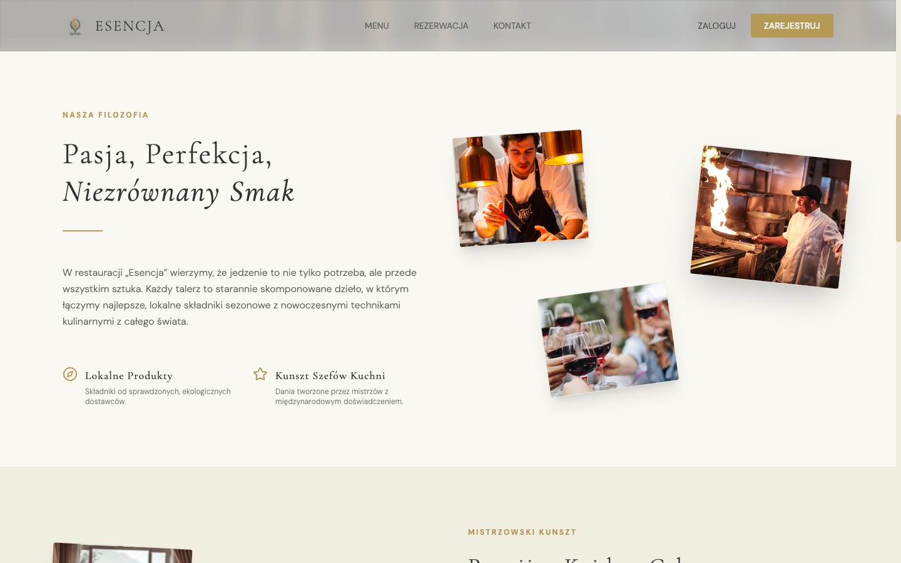 | 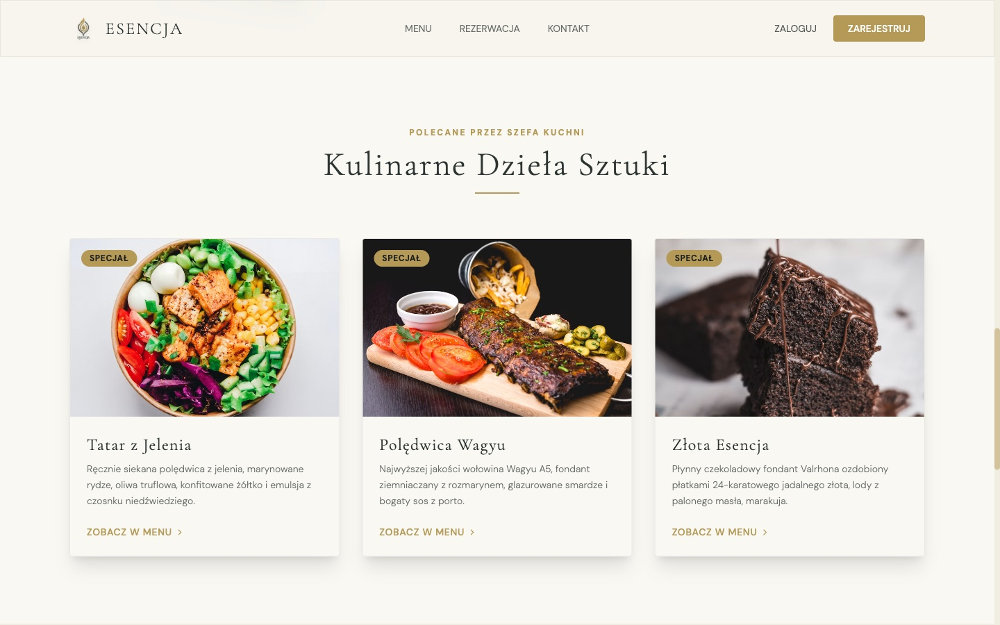 |

| Karta menu | Kontakt |
|---|---|
| 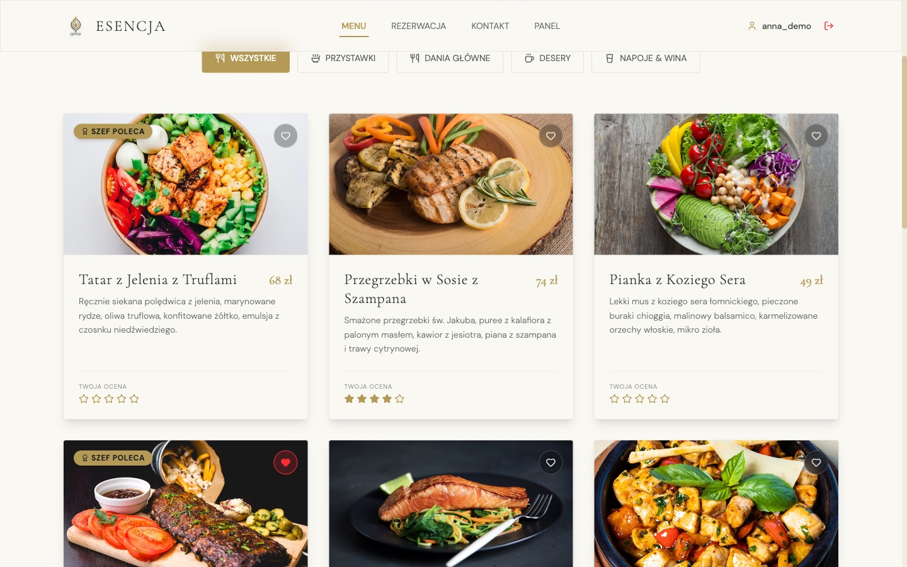 | 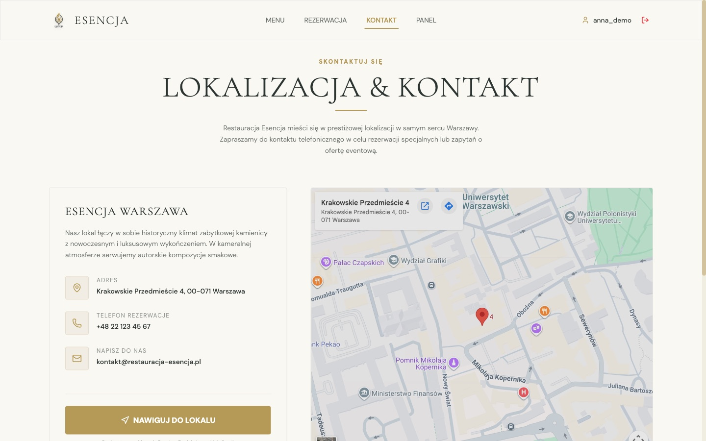 |

### Rezerwacja

| Plan sali przed wyborem terminu | Wybór stolika i formularz |
|---|---|
| 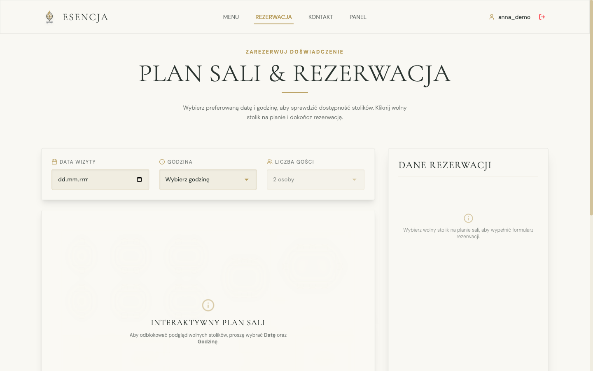 | 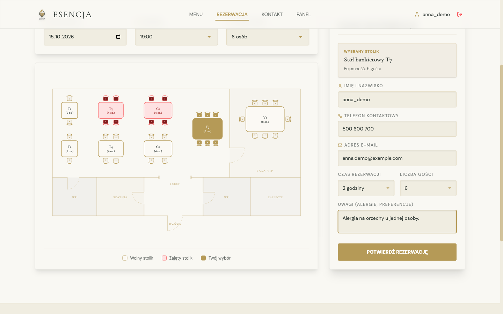 |

| Potwierdzenie | Rejestracja |
|---|---|
| 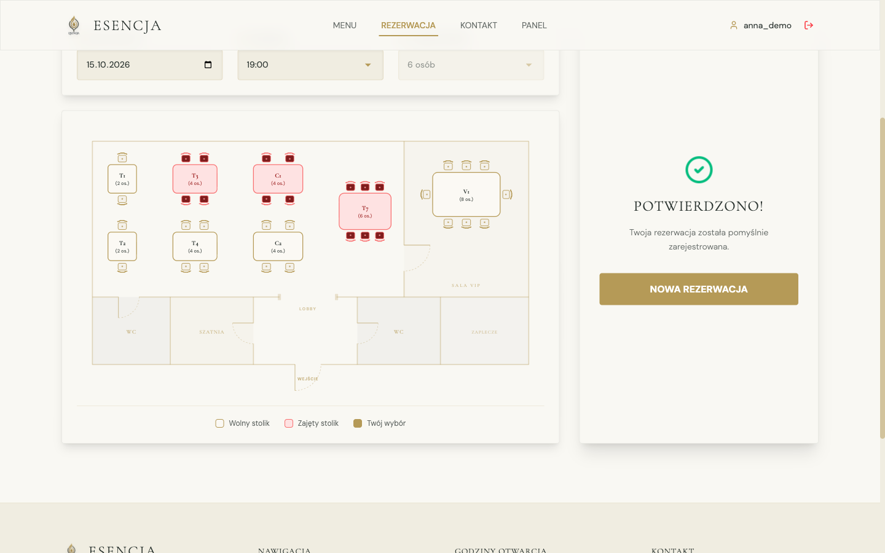 | 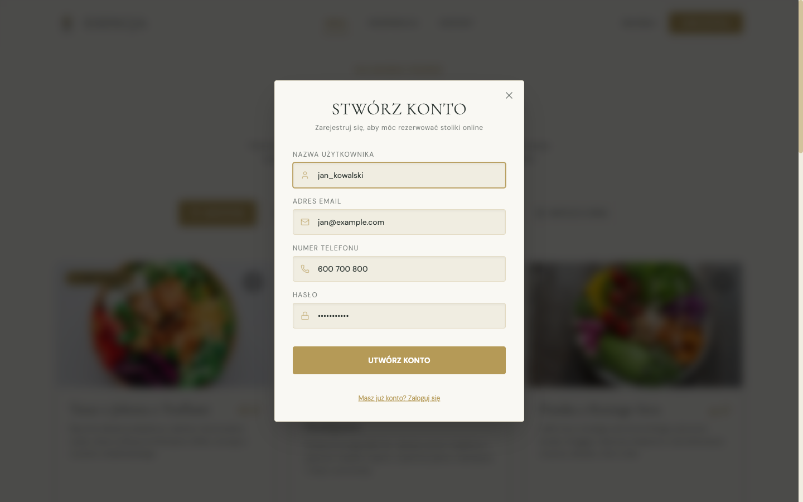 |

### Panel klienta

| Moje rezerwacje | Ulubione dania |
|---|---|
| 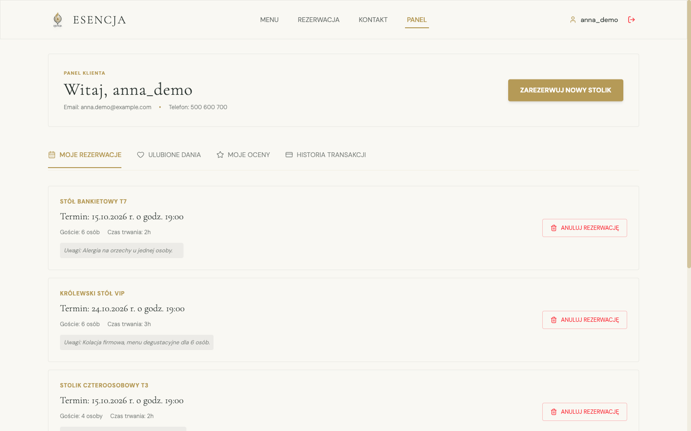 | 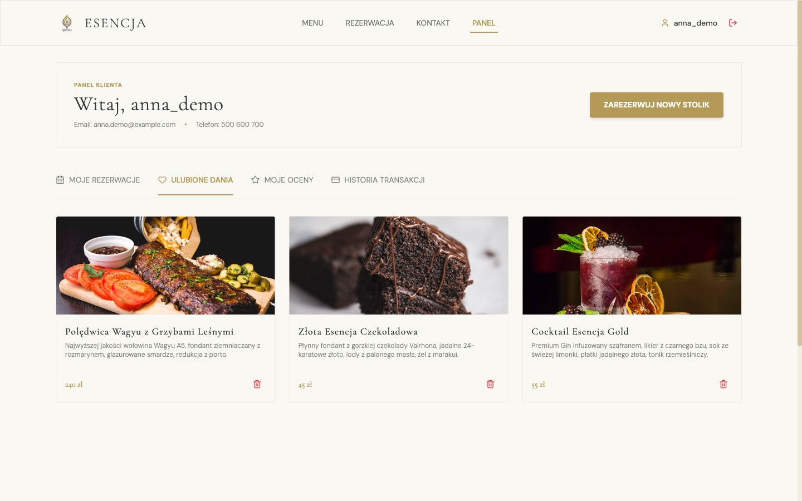 |

| Moje oceny | Historia transakcji |
|---|---|
| 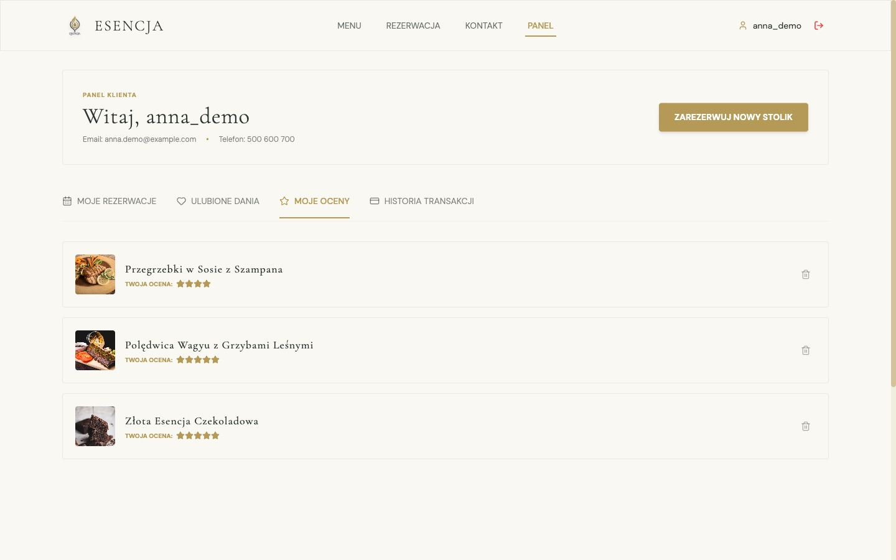 | 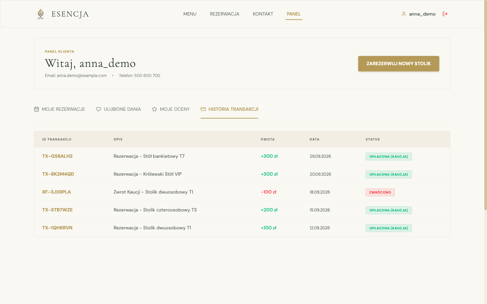 |

### Telefon

| Strona główna | Plan sali | Menu nawigacji |
|---|---|---|
| 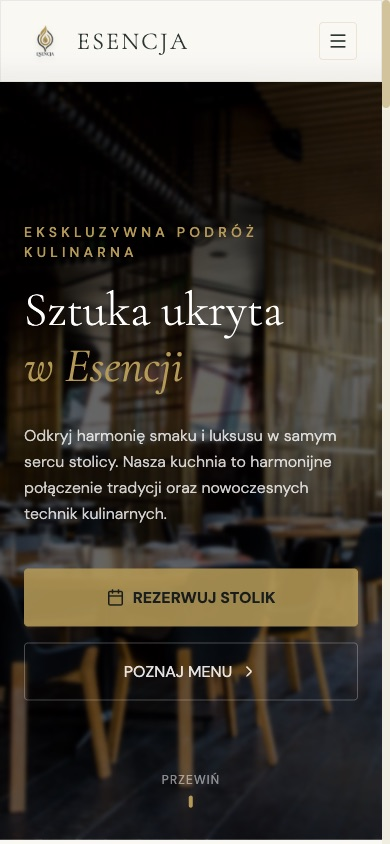 | 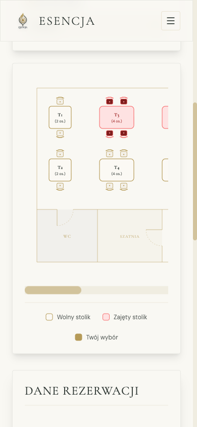 | 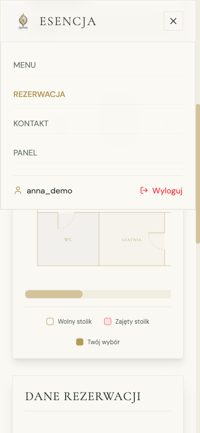 |

Konta, rezerwacje i transakcje na zrzutach są przykładowe.

## Uruchomienie

Wymagany Node.js 20.19+ lub 22.12+ (wymóg Vite 8).

```bash
npm install
npm run dev        # http://localhost:5173
```

Aplikacja nie potrzebuje pliku `.env`, kluczy API ani bazy danych — wszystko działa od razu po instalacji.
Aby zacząć od zera, wyczyść dane strony w przeglądarce (DevTools → Application → Local Storage).

| Skrypt | Co robi |
|---|---|
| `npm run dev` | Serwer deweloperski Vite z HMR |
| `npm run build` | Sprawdzenie typów (`tsc -b`) i build produkcyjny do `dist/` |
| `npm run preview` | Podgląd zbudowanej wersji |
| `npm run lint` | Lint przez oxlint |

### Wdrożenie

`dist/` to statyczne pliki — wystarczy dowolny hosting statyczny (Vercel, Netlify, GitHub Pages, nginx).
Routing opiera się na `#hash`, więc serwer nie wymaga reguł przepisywania adresów.

## Struktura

```
src/
  App.tsx                  widoki, routing na hashach, sesja użytkownika
  components/
    Navbar.tsx, Footer.tsx nawigacja (desktop + mobile), godziny otwarcia, kontakt
    Hero.tsx               strona startowa, opinie, polecane dania
    Menu.tsx               karta menu, ulubione, oceny
    Reservation.tsx        plan sali (SVG), dostępność, formularz, kaucja
    Dashboard.tsx          panel klienta
    Auth.tsx               modal logowania i rejestracji
    ContactMap.tsx         kontakt i mapa
    BlurText.tsx, ScrollReveal.tsx   animacje tekstu
  data/menuData.ts         pozycje menu
  types/index.ts           typy Dish, Reservation, User
  utils/validation.ts      walidacja telefonu i e-maila
  index.css                tokeny kolorów i fontów (Tailwind @theme)
public/                    logo, ikona, favicon
docs/
  documentation.pdf / .html   dokumentacja techniczna i raport testów e2e
  screenshots/                zrzuty używane w README
```

## Design

Paleta „Light Velvet Cream / Gold”: kremowe tło `#F9F8F3`, złoto `#B59A57`, ciemna zieleń `#2C3531`.
Nagłówki w Cormorant Garamond, tekst w DM Sans. Strona ma tylko jasny motyw — niezależnie od ustawień
systemu. Animacje (Framer Motion, GSAP) respektują ustawienie „ogranicz ruch”.

## Bezpieczeństwo i ograniczenia

To prototyp front-endu. Przed przyjęciem pierwszej prawdziwej rezerwacji potrzebny jest backend:

- **Hasła są w `localStorage` jawnym tekstem.** Może je odczytać każdy skrypt na stronie i każdy, kto ma
  dostęp do przeglądarki. Nie używaj prawdziwych haseł.
- **Rezerwacje nie opuszczają przeglądarki.** Restauracja ich nie dostaje, a dwa różne urządzenia mogą
  zarezerwować ten sam stolik.
- **Płatności są symulowane** — nie ma bramki płatniczej ani prawdziwych kaucji.
- Nie ma weryfikacji e-maila ani resetu hasła.

Minimalne API, które zastąpi `localStorage` (rejestracja, logowanie, dostępność, rezerwacje, ulubione, oceny),
jest rozpisane w [`docs/documentation.pdf`](docs/documentation.pdf) w sekcji „Bezpieczeństwo i ograniczenia”.

## Wydajność

Build produkcyjny: JS 538 kB (173 kB gzip), CSS 45 kB (8 kB gzip). Większość to biblioteki animacji
(Framer Motion, GSAP) i confetti — to pierwsze miejsce do optymalizacji. Zdjęcia dań i wnętrz są ładowane
z Unsplash w szerokości 600–800 px.

## Przed publikacją

- **Wyróżnienia i opinie** — sekcja „Mistrzowski kunszt” pokazuje „Michelin Guide — Rekomendacja 2026”
  i „Champion de Qualité”, a karuzela zawiera imienne opinie gości. Zostaw tylko prawdziwe wyróżnienia
  i opinie; nazwa Michelin jest znakiem towarowym.
- **Zdjęcia dań** pochodzą z Unsplash i nie wszystkie pasują do opisów (np. tatar z jelenia pokazuje
  miskę z tofu). Najlepiej zastąpić je własnymi zdjęciami.
- **Treści zewnętrzne** — czcionki Google Fonts, mapa Google i zdjęcia z Unsplash są pobierane z serwerów
  zewnętrznych; uwzględnij to w polityce prywatności (RODO).

## Dokumentacja

- [`docs/documentation.pdf`](docs/documentation.pdf) (i wersja [HTML](docs/documentation.html)) — architektura,
  widoki, model danych w `localStorage` z przykładami, reguły rezerwacji, karta menu, ograniczenia,
  propozycja API oraz raport testów e2e z listą poprawek i rzeczy do zrobienia.
